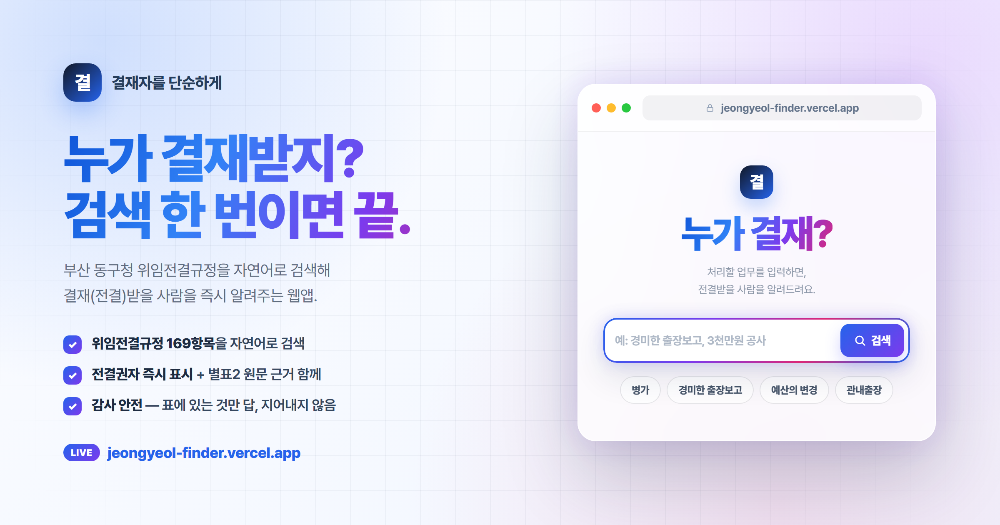

<p align="center">
  <a href="https://jeongyeol-finder.vercel.app">
    
  </a>
</p>

<p align="center">
  <a href="https://jeongyeol-finder.vercel.app"><b>▶ 라이브 데모 — jeongyeol-finder.vercel.app</b></a>
</p>

<p align="center">
  
</p>

# 결재자를 단순하게

부산 동구청 **위임전결규정(169개 항목)** 을 자연어로 검색해, *"내가 이 업무를 할 때 누구에게 전결(결재)받는지"* 를 알려주는 웹앱입니다. 채팅이 아니라 **검색창 하나 → 결과 모달** 방식.

라이브: https://jeongyeol-finder.vercel.app

---

## 어떻게 동작하나 (원리)

### 1) 핵심 아이디어
전결규정 원문(표)을 사람이 매번 뒤지는 대신, **검색하기 좋은 구조의 표 1개**로 정규화해 두고, LLM이 그 표만 근거로 답하게 했습니다. 규정이 169행으로 작아 **표 전체를 통째로 LLM 프롬프트에 주입**하는 단순한 방식(벡터DB/RAG 불필요)으로 충분히 정확합니다.

### 2) 데이터 구조 (`data/전결_검색테이블_통합.csv`)
원문 전결규정을 "안건 1건 = 1행"으로 풀고, 갈리는 조건을 컬럼으로 만들었습니다.

| 컬럼 | 역할 |
|---|---|
| 검색키 / 검색키워드 | 업무 검색(동의어 포함) |
| **분기기준** | 전결권자가 무엇으로 갈리는지: `없음 / 금액 / 직급 / 중요도 / 부서수 / 기간` |
| 분기조건 · 금액하한 · 금액상한 | 좁히는 값(금액은 **구간**으로 저장) |
| 기안권자 · **전결권자** | 누가 올리고, 누구한테 받는지(=핵심 답) |
| 비고 | 준용·단독전결·원문미규정(gap) 등 |

### 3) 처리 흐름
```
브라우저: 업무명 입력 → 검색
   │  POST /api/lookup  { query }
   ▼
Next.js 서버 (Vercel) ── API 키 보관
   │  시스템 프롬프트 = [근거 규칙] + [표 169행 전체]
   ▼
LLM (Claude/OpenAI)  →  구조화 JSON 반환
   │  { found, approver, drafter, reason, note,
   │    needsChoice, question, options:[{label, approver}] }
   ▼
결과 모달: 결재자(전결권자) 크게 표시.
분기(금액·직급 등)가 있으면 모달 안에서 버튼으로 한 번 더 선택.
```

### 4) 정확성·감사 안전 규칙 (`lib/systemPrompt.ts`)
- 표에 **있는 것만** 답한다. 없으면 `found=false`, **전결권자를 지어내지 않는다**.
- 금액은 `금액하한~상한` **구간**으로 판단(“이하” 직역 금지).
- `비고`의 **준용/단독전결/gap** 을 결과에 함께 안내.

---

## 기술 스택 / 구조
- **Next.js 14 (App Router) + TypeScript**, 배포 **Vercel**(GitHub push 자동배포)
- LLM: **Claude(Anthropic) / OpenAI 둘 다 지원**, `LLM_PROVIDER` 환경변수로 전환

```
app/page.tsx             검색 UI + 결과 모달(분기 되물음)
app/api/lookup/route.ts  POST 핸들러(질의→JSON)
lib/table.ts             CSV 로딩 → 프롬프트 텍스트화
lib/systemPrompt.ts      근거 규칙 + 표 조립(JSON 출력 지시)
lib/llm.ts               Anthropic/OpenAI 어댑터(+캐싱·JSON 모드)
lib/json.ts              LLM 응답에서 JSON 추출
data/...통합.csv         검색테이블(169행)
```

---

## 로컬 실행
```bash
npm install
cp .env.example .env.local   # 키 채우기
npm run dev                  # http://localhost:8000
```

## 환경변수
- `LLM_PROVIDER`: `anthropic` 또는 `openai`
- `ANTHROPIC_API_KEY` / `OPENAI_API_KEY`: 선택한 제공자 키
- `ANTHROPIC_MODEL`(기본 claude-sonnet-4-6) / `OPENAI_MODEL`(기본 gpt-4o)

## 배포 (Vercel + GitHub 자동배포)
GitHub에 push → Vercel 프로젝트가 자동 빌드·배포. 환경변수는 Vercel Settings에 등록.

## 데이터 갱신
원규정 변경 시 별도 프로젝트의 `build_검색테이블.py` 재실행 → `전결_검색테이블_통합.csv`를 `data/`에 덮어쓰고 commit·push.

## 테스트
```bash
npm test
```
(골든 회귀 테스트는 API 키가 있을 때만 실제 LLM 호출, 없으면 자동 skip)

---

## 한계 · 주의
- **참고용**입니다. 최종 확인은 원규정·담당부서.
- 표에 없는 사항, 준용(해석)으로 채운 항목은 그 사실을 함께 안내합니다.
- 표가 수천 행 이상으로 커지면 "표 전체 주입" 대신 함수호출(조회)·RAG로 바꿔야 합니다(현재 169행이라 불필요).
